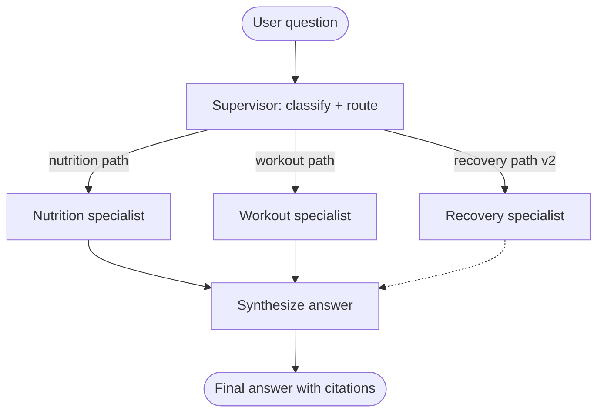
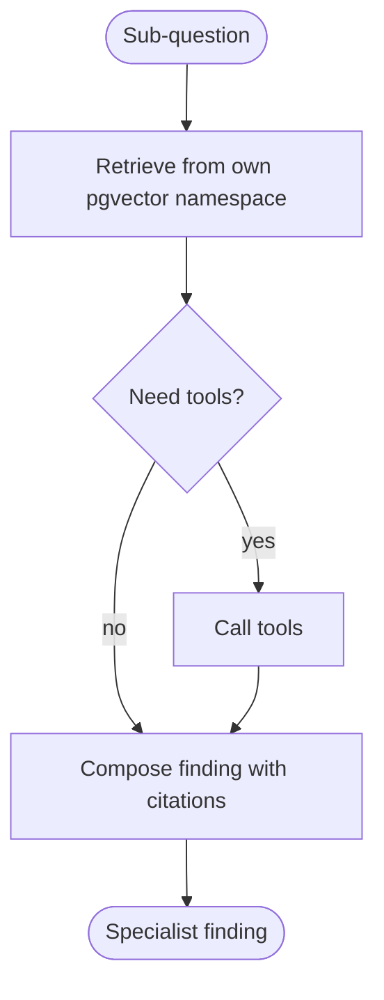

# Centenarian Coach Multi-Agent

> **This is a portfolio + course artifact.** The demo runs without authentication.

A LangGraph supervisor with specialist subgraphs. You ask one question. A coordinator decides which specialists to consult. Each specialist has its own retrieval store and its own tools. The coordinator weaves the findings into one answer with citations.

[]() <!-- replace with real CI badge -->
[](LICENSE)
[]()
[]()
[](https://smith.langchain.com)

---

## TL;DR

Most AI coaches use one prompt for everything. This one routes your question to the specialist that actually knows the answer.

The supervisor classifies the user's question, decides which specialists to invoke (one, two, or all three), and synthesizes their findings. Each specialist (Nutrition, Workout, Recovery) owns its own retrieval namespace and its own tools. Specialists do not read each other's outputs — the supervisor handles synthesis.

This repo demonstrates three LangGraph patterns: supervisor routing, per-agent retrieval, and state passing across nested subgraphs.

Companion 5-lesson course (Module 2 of the series): [livelongworkfree.com/course/multi-agent](https://livelongworkfree.com/course/multi-agent)
Companion podcast (S1E3 — coming after S1E1): [livelongworkfree.com/podcast](https://livelongworkfree.com/podcast)
Sister projects in the same curriculum: [Triage Agent](https://github.com/dapperAuteur/witus-triage-agent), [Field Reporter](https://github.com/dapperAuteur/wanderlearn-field-reporter)

---

## The problem

A single-agent coach conflates domains. Ask "I slept 5 hours, should I do legs today?" and a single-prompt agent has to be a nutrition expert, a strength training expert, a recovery expert, and a synthesizer all at once. Quality suffers.

The right architecture is a coordinator that knows when to consult one specialist (a pure nutrition question), when to consult two (cross-domain like the legs example), and when to consult all three.

Built originally for CentenarianOS — my personal "live to 100 in good shape" operating system — but architected so the same supervisor + specialist pattern works anywhere. The sample knowledge bases shipped with this repo are health and fitness; swap in your own corpora and the routing logic stays the same.

---

## Architecture



Each specialist is itself a small graph:



---

## The three patterns

This repo demonstrates three LangGraph patterns. Each has a companion lesson under `/docs/lessons/`.

### 1. Supervisor routing

A typed routing decision before any specialist runs. The supervisor returns a `RoutingDecision` object with explicit booleans for each specialist, plus optional sub-questions if it wants to rewrite the user's query for a specialist.

```ts
type RoutingDecision = {
  consultNutrition: boolean;
  consultWorkout: boolean;
  consultRecovery: boolean;
  subQuestions: {
    nutrition?: string;
    workout?: string;
    recovery?: string;
  };
  rationale: string;
};
```

The rationale field forces the supervisor to justify its decision in the trace. If routing is wrong, you can see why in seconds.

Full supervisor: [`src/agents/supervisor/`](./src/agents/supervisor/)

### 2. Per-agent retrieval

Each specialist has its own pgvector namespace. Nutrition does not see workout docs. Workout does not see recovery docs. This is the difference between three specialists and one generalist with a fancy prompt.

```ts
export async function retrieveNutritionContext(query: string) {
  return await pgvector.search({
    namespace: 'nutrition_kb',
    query,
    limit: 5,
  });
}
```

Each namespace can be tuned, evaluated, and updated independently. Adding a fourth specialist (Mobility, Mindset, whatever your domain needs) is a contained change.

All retrieval modules: [`src/agents/*/retrieval.ts`](./src/agents/)

### 3. State passing across nested subgraphs

The shared `CoachState` carries the user query, the routing decision, each specialist's finding, and the final synthesis. Specialists write to their own slot in `findings` and never to each other's.

```ts
type CoachState = {
  sessionId: string;
  userId: string;
  userQuery: string;
  routing?: RoutingDecision;
  findings: {
    nutrition?: SpecialistFinding;
    workout?: SpecialistFinding;
    recovery?: SpecialistFinding;
  };
  finalAnswer?: {
    text: string;
    citations: Citation[];
    consultedAgents: ('nutrition' | 'workout' | 'recovery')[];
  };
};
```

Full state shape: [`src/state.ts`](./src/state.ts)

---

## Quick start

You need Node 20+, a Supabase project with pgvector enabled, an Anthropic API key, a Google API key (for Gemini embeddings), and a LangSmith account.

```bash
# 1. Clone
git clone https://github.com/dapperAuteur/centenarian-coach-multiagent.git
cd centenarian-coach-multiagent

# 2. Install
pnpm install

# 3. Configure
cp .env.example .env
# Fill in ANTHROPIC_API_KEY, GOOGLE_API_KEY, SUPABASE_URL,
# SUPABASE_SERVICE_ROLE_KEY, LANGSMITH_API_KEY

# 4. Migrate schema
pnpm db:migrate

# 5. Seed knowledge bases (sample nutrition + workout corpora)
pnpm kb:seed

# 6. Run the dev server
pnpm dev
```

Open `http://localhost:3000/coach` and try these three sample questions to see routing in action:

1. "How many grams of protein should I eat after a heavy squat session?" → routes to **Nutrition + Workout**.
2. "I slept 5 hours last night, should I do legs today?" → routes to **Workout + Recovery** (or all three in v2).
3. "What is creatine and how does it work?" → routes to **Nutrition only**.

Watch each trace in LangSmith to see the supervisor decision, the specialist subgraphs, and the synthesizer working in sequence.

If clone-to-running takes longer than 20 minutes, that is a bug. Open an issue.

---

## What you can learn from this repo

Five lessons under `/docs/lessons/`. Each is ~1,200 words plus inline code.

- [Lesson 1 — Single vs Multi-Agent](./docs/lessons/01-single-vs-multi-agent.md). When the extra complexity actually pays.
- [Lesson 2 — Supervisor Routing](./docs/lessons/02-supervisor-routing.md). Writing a router that returns structured decisions.
- [Lesson 3 — Per-Agent Retrieval](./docs/lessons/03-per-agent-retrieval.md). Why each specialist needs its own retrieval namespace.
- [Lesson 4 — State Passing](./docs/lessons/04-state-passing.md). Sharing context across nested subgraphs without stomping.
- [Lesson 5 — Evals](./docs/lessons/05-evals.md). Building a LangSmith eval dataset and rubric for multi-agent answers.

Lessons use a different sample domain (a fictional customer support desk with three product specialists) so the pattern transfers cleanly.

---

## Tech stack

| Layer            | Choice                                      |
|------------------|---------------------------------------------|
| Runtime          | Node 20+, Next.js 14 (existing app)         |
| Language         | TypeScript strict                           |
| Agent framework  | `@langchain/langgraph` ^0.2                 |
| LLM SDK          | `@langchain/anthropic`                      |
| Models           | Sonnet 4.6 (supervisor + synthesizer), Haiku 4.5 (specialist composers) |
| Embeddings       | Gemini `text-embedding-004`                 |
| Vector store     | Supabase pgvector                           |
| Auth             | Supabase Auth                               |
| Observability    | LangSmith                                   |
| UI streaming     | Vercel AI SDK                               |
| Testing          | Vitest                                      |

Why two LLM providers in one stack: Gemini's embeddings are cheap, fast, and good. Claude's reasoning is best-in-class for routing decisions and synthesis. Use each where it earns its place.

For a Gemini-only version of this same agent, see Appendix A in the PRD. The all-Gemini variant ships with retry logic on each specialist because structured-output reliability is a real concern when three specialists produce typed findings in one run.

---

## Project structure

```
centenarian-coach-multiagent/
├── README.md                       <- you are here
├── docs/
│   ├── architecture.md             <- diagrams + design notes
│   └── lessons/                    <- 5 companion lessons
├── src/
│   ├── agents/
│   │   ├── supervisor/             <- routing logic
│   │   ├── nutrition/              <- specialist subgraph + tools
│   │   ├── workout/                <- specialist subgraph + tools
│   │   └── recovery/               <- v2
│   ├── synthesizer/                <- weaves findings into final answer
│   ├── state.ts                    <- typed state object
│   ├── app/
│   │   ├── api/coach/              <- streaming REST routes
│   │   └── coach/                  <- chat-style UI
│   ├── db/
│   │   └── migrations/
│   └── lib/
│       ├── langsmith.ts
│       ├── embeddings.ts
│       └── pgvector.ts
├── tests/                          <- unit + graph tests
├── kb-fixtures/                    <- sample nutrition + workout corpora
└── package.json
```

---

## Configuration

```env
ANTHROPIC_API_KEY=
GOOGLE_API_KEY=                  # for Gemini embeddings only
SUPABASE_URL=
SUPABASE_SERVICE_ROLE_KEY=
LANGSMITH_API_KEY=
LANGSMITH_PROJECT=centenarian-coach-multiagent
LANGSMITH_TRACING=true
NEXTAUTH_SECRET=
NEXTAUTH_URL=http://localhost:3000
```

LangSmith is on by default. Project will run without it (with a console warning).

---

## Testing

```bash
pnpm test                       # all tests
pnpm test:supervisor            # routing decisions
pnpm test:specialists           # individual specialist subgraphs
pnpm test:integration           # full graph end-to-end
pnpm test:eval                  # routing accuracy on 10 hand-labeled questions
```

The eval target measures whether the supervisor consulted the right specialists for each of 10 hand-labeled questions. Acceptance criterion: 90% or better. Latest measured number is in `EVAL.md`.

---

## LangSmith trace

Every coach query writes a trace. The trace shows:
- The supervisor's routing decision (with rationale).
- Each invoked specialist as a nested subgraph.
- Tool calls inside each specialist.
- The synthesizer's final composition.

For a representative trace from a real cross-domain question, see the pinned run in the LangSmith project view.

---

## A real bug I caught

The first time I ran the system against 10 cross-domain test questions, the supervisor over-routed. It consulted all three specialists on questions that only needed one. The trace showed the routing rationale was vague — "the question might involve multiple domains" — without committing to a decision.

The fix was two-part. First, I tightened the routing prompt to require the supervisor to default to one specialist and only escalate to two or three when there was clear evidence in the question. Second, I added a `singleSpecialistConfidence` field to the `RoutingDecision` schema — if the supervisor was over 0.8 confident the question was single-domain, it had to pick exactly one specialist and explain why.

Token usage dropped 40% on the single-domain evals after that fix. The trace caught it before any user saw a slow response.

Lesson 2 walks through this in detail.

---

## Roadmap

This repo ships v1 with two specialists. The visible roadmap:

- [ ] v1.1 — Streaming improvements. Show partial specialist findings as they arrive.
- [ ] v2 — Recovery specialist with sleep + HRV tools.
- [ ] v2.1 — LangSmith eval dataset (20 questions) running in CI.
- [ ] v3 — Conversation memory across sessions (with user opt-in).
- [ ] v3.1 — Custom specialist plugin API for adding domain experts without touching core.

Track progress in [Issues](./issues). PRs not currently accepted; this is a portfolio + course project.

---

## Related work

- **Triage Agent (single-agent, human-in-the-loop):** [github.com/dapperAuteur/witus-triage-agent](https://github.com/dapperAuteur/witus-triage-agent)
- **Field Reporter (reflection-loop agent):** [github.com/dapperAuteur/wanderlearn-field-reporter](https://github.com/dapperAuteur/wanderlearn-field-reporter)
- **Honest model comparison:** [Gemini vs Claude SWOT](https://brandanthonymcdonald.com/blog/gemini-vs-claude-swot)
- **Podcast walkthrough:** [Live Long. Work Free.](https://livelongworkfree.com/podcast)
- **4-lesson sister course (single-agent triage):** [livelongworkfree.com/course/triage](https://livelongworkfree.com/course/triage)
- **5-lesson course for this repo:** [livelongworkfree.com/course/multi-agent](https://livelongworkfree.com/course/multi-agent)

The three repos together cover the three patterns that show up most in production agent engineering: single-agent + human-in-the-loop (Triage), multi-agent + supervisor routing (this repo), and reflection loops (Field Reporter). Together they are a complete curriculum.

---

## Why this exists

I run CentenarianOS — a personal operating system for living a long, healthy life. The AI coach inside it started as one prompt and one retrieval call. Cross-domain questions kept returning shallow answers. Rebuilding the coach as a supervisor with specialist subgraphs took a week and made the answers materially better.

I also built this twice — once on Claude, once on Gemini. The Claude version is in this repo. The honest comparison is in the SWOT post linked above. Multi-agent is the workload where the model choice matters most.

If you are building a domain-spanning agent — a finance assistant, a multi-product support tool, a coding helper that needs to know multiple frameworks — the supervisor + specialist pattern is what you eventually arrive at. The five lessons in `/docs/lessons/` are how I would have wanted to learn this six months ago.

---

## About the author

Brand Anthony McDonald. Solo builder. Operator of the WitUS ecosystem. Trained actor, working educator, sometimes a broadcast-team contractor at the Indianapolis Motor Speedway. Based in Indianapolis.

- Blog: [brandanthonymcdonald.com](https://brandanthonymcdonald.com)
- Podcast: [livelongworkfree.com](https://livelongworkfree.com)
- LinkedIn: [linkedin.com/in/brandanthonymcdonald](https://linkedin.com/in/brandanthonymcdonald)
- Email: a@awews.com

If you are hiring for Developer Relations, Education Engineering, or Solutions Engineering and you have read this far, this repo is what my day-to-day work looks like. Reach out.

---

## License

MIT. See [LICENSE](./LICENSE).

Fork it. Ship it. Teach from it. Attribution appreciated, not required.
