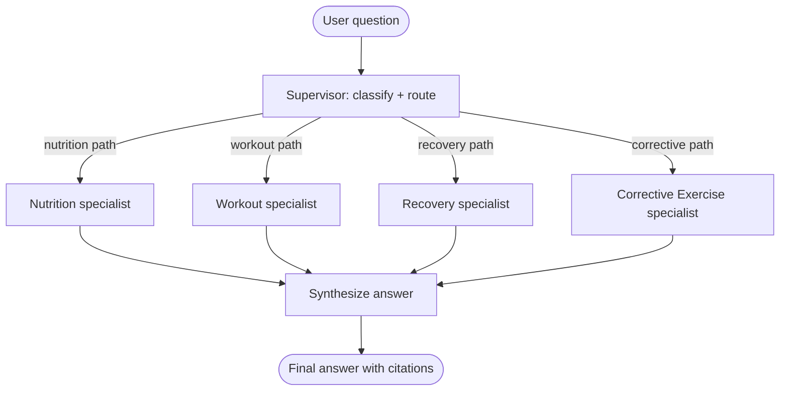

# Centenarian Coach Multi-Agent

> **This is a portfolio + course artifact.** The live demo is gated to a single admin email — anyone else can join a paid-access waitlist.

**Live demo:** [centenarian-coach-multiagent.witus.online](https://centenarian-coach-multiagent.witus.online) — gated to a single admin email; everyone else can join the access waitlist.

A LangGraph supervisor with specialist subgraphs. You ask one question. A coordinator decides which specialists to consult. Each specialist has its own retrieval store and its own tools. The coordinator weaves the findings into one answer with citations.

[]() <!-- replace with real CI badge -->
[](LICENSE)
[]()
[]()
[](https://smith.langchain.com)

---

## TL;DR

Most AI coaches use one prompt for everything. This one routes your question to the specialist that actually knows the answer.

The supervisor classifies the user's question, decides which specialists to invoke (one, two, three, or all four), and synthesizes their findings. Each specialist (Nutrition, Workout, Recovery, Corrective Exercise) owns its own retrieval namespace and its own tools. Specialists do not read each other's outputs — the supervisor handles synthesis.

This repo demonstrates three LangGraph patterns: supervisor routing, per-agent retrieval, and state passing across nested subgraphs.

This repo is the artifact for a LangChain Academy **Project** course (see [The course](#the-course)) — 6 modules, 28 lessons, with a ~2.5-hour video walkthrough in production.
Companion podcast (S1E3 — coming after S1E1): *coming soon.*
Sister courses in the same curriculum: [Triage Agent](https://github.com/dapperAuteur/witus-triage-agent) (Quickstart tier), [Field Reporter](https://github.com/dapperAuteur/wanderlearn-field-reporter) (Foundation tier).

---

## The problem

A single-agent coach conflates domains. Ask "I slept 5 hours, should I do legs today?" and a single-prompt agent has to be a nutrition expert, a strength training expert, a recovery expert, and a synthesizer all at once. Quality suffers.

The right architecture is a coordinator that knows when to consult one specialist (a pure nutrition question), when to consult two (cross-domain like the legs example), and when to consult all four.

Built originally for CentenarianOS — my personal "live to 100 in good shape" operating system — but architected so the same supervisor + specialist pattern works anywhere. The repo ships an **empty `kb-fixtures/` directory**: bring your own corpus (any domain), seed it, and the routing logic is unchanged.

---

## Architecture



Each specialist is itself a small graph:


---

## The three patterns

This repo demonstrates three LangGraph patterns. Each has a companion lesson under `/docs/lessons/`.

### 1. Supervisor routing

A typed routing decision before any specialist runs. The supervisor returns a `RoutingDecision` — which specialists to consult, the primary one, an optional rewritten sub-question per specialist, and a rationale. It is produced with a Zod schema via `withStructuredOutput`, so an invalid route is unrepresentable.

```ts
type Agent = 'nutrition' | 'workout' | 'recovery' | 'corrective';

type RoutingDecision = {
  agents: Agent[];                          // specialists to consult
  primaryAgent: Agent;                      // the most relevant one
  subQuestions: Partial<Record<Agent, string>>;
  rationale: string;
};
```

The rationale field forces the supervisor to justify its decision in the trace. If routing is wrong, you can see why in seconds.

Full supervisor: [`src/agents/supervisor/`](./src/agents/supervisor/)

### 2. Per-agent retrieval

Each specialist has its own pgvector namespace. Nutrition does not see workout docs. Workout does not see recovery docs. This is the difference between four specialists and one generalist with a fancy prompt.

```ts
export async function retrieveNutritionKb(query: string, k = 5) {
  const embedding = await geminiEmbed(query);             // Gemini, 768-dim
  const matches = await matchCoachKb(embedding, 'nutrition_kb', k);
  return matches.map((m) => ({
    source: m.source, snippet: m.content, agent: 'nutrition' as const,
  }));
}
```

Each namespace can be tuned, evaluated, and updated independently. Adding another specialist (Mindset, whatever your domain needs) is a contained change.

All retrieval modules: [`src/agents/*/retrieval.ts`](./src/agents/)

### 3. State passing across nested subgraphs

The shared `CoachState` carries the user query, the routing decision, each specialist's finding, and the final synthesis. Specialists write to their own slot in `findings` and never to each other's.

```ts
type CoachState = {
  sessionId: string;
  userQuery: string;
  routing?: RoutingDecision;
  findings: {
    nutrition?: SpecialistFinding;
    workout?: SpecialistFinding;
    recovery?: SpecialistFinding;
    corrective?: SpecialistFinding;
  };
  finalAnswer?: {
    text: string;
    citations: Citation[];
    consultedAgents: ('nutrition' | 'workout' | 'recovery' | 'corrective')[];
  };
};
```

Full state shape: [`src/state.ts`](./src/state.ts)

---

## Quick start

You need Node 20+, a Postgres database with pgvector (Neon's free tier works), an Anthropic API key, a Gemini API key (for embeddings), and optionally a LangSmith account for tracing.

```bash
# 1. Clone
git clone https://github.com/dapperAuteur/centenarian-coach-multiagent.git
cd centenarian-coach-multiagent

# 2. Install
pnpm install

# 3. Configure
cp .env.example .env.local
# Fill in ANTHROPIC_API_KEY, GEMINI_API_KEY, STORAGE_DATABASE_URL,
# and (optional) LANGSMITH_API_KEY

# 4. Migrate schema (applies src/db/migrations to your database)
pnpm db:migrate

# 5. Drop your own corpus into kb-fixtures/ (see kb-fixtures/README.md
#    for the file shape) and seed it into the coach_kb table
pnpm kb:seed

# 6. Run the dev server
pnpm dev
```

Open `http://localhost:3000/coach` and try these four sample questions to see routing in action:

1. "How much protein should a 70-year-old eat to preserve muscle?" → routes to **Nutrition**.
2. "How should I progress my squat once I can hit all my reps?" → routes to **Workout**.
3. "My knee caves inward when I squat — how do I fix it?" → routes to **Corrective Exercise**.
4. "I want to build muscle — how should I combine eating and training?" → routes to **Nutrition + Workout**.

Watch each trace in LangSmith to see the supervisor decision, the specialist subgraphs, and the synthesizer working in sequence.

Two more pages: `/coach/history` browses past sessions with fuzzy search, and `/admin` is a runtime dashboard for picking the provider and per-role models without a redeploy.

If clone-to-running takes longer than 20 minutes, that is a bug. Open an issue.

---

## The course

This repo is the artifact for a LangChain Academy **Project** course,
*Domain-Specialist Multi-Agent with Per-Agent RAG* — 6 modules, 28 lessons, with a
~2.5-hour video walkthrough in production. It is the first project-tier course to
teach **per-agent RAG**: every specialist owns its own retrieval namespace, and
answers carry citations grounded in that specialist's corpus.

Lessons live in [`docs/course/`](./docs/course/). Every lesson names the exact
files it touches and pins a LangSmith trace, and the branch carries a **tagged
commit per lesson** so you can check out any lesson's starting state:

```bash
git checkout course/lesson-04   # the first-run smoke test, ready to run
```

| Module | Lessons | What you build |
|---|---|---|
| **0 · Setup + scope** | 4 | Clone → seed → ask a question → read the trace. The coach runs before any architecture lesson. |
| **1 · The supervisor** | 4 | The Zod routing schema, temperature-0 classification, and the topology that *enforces* ordering. |
| **2 · Specialist #1 (Nutrition)** | 4 | Per-agent retrieval namespacing, the embedding-consistency trap, and type-enforced specialist isolation. |
| **3 · Specialists #2 + #3** | 3 | Workout + Recovery: the specialist template, and state fan-in without stomping. |
| **4 · LangSmith evaluation** | 5 | Routing + citation evaluators, an LLM-judge grounding evaluator, and the find-bug → add-example → re-run loop on a growing dataset. |
| **5 · Deployment + multi-tenant** | 4 | LangGraph Platform deployment, per-user state, and cost/latency dashboards. |
| **6 · Extension launching pad** | 4 | How to add a new specialist (worked with the `corrective` agent), plus 3–5 extensions with file paths. |

Module 0 is live; Modules 1–6 are being authored on the
`feat/langchain-academy-project-refactor` branch. The course holds to one
artifact — the coach — and every lesson contributes to it (no separate transfer
exercise on an unrelated domain).

---

## Tech stack

| Layer            | Choice                                      |
|------------------|---------------------------------------------|
| Runtime          | Node 20+, Next.js 16 (standalone, App Router)|
| Language         | TypeScript strict                           |
| Agent framework  | `@langchain/langgraph` ^1.x                 |
| LLM SDK          | `@langchain/anthropic` / `@langchain/google-genai` |
| Models           | Claude Sonnet 4.6 + Haiku 4.5, or Gemini 2.5 Flash — switchable |
| Embeddings       | Gemini `gemini-embedding-001` (768-dim)     |
| ORM + vector     | Drizzle ORM · Postgres + pgvector (Neon)    |
| Auth             | Auth.js v5 email magic link (Mailgun) — single-admin gate, waitlist for everyone else |
| Observability    | LangSmith (fail-soft)                       |
| UI streaming     | NDJSON stream from a Next.js route handler  |
| Testing          | Vitest                                      |

Why two providers: Gemini's embeddings are cheap and good; Claude's reasoning is strong for routing and synthesis. The chat model is switchable — set `COACH_LLM_PROVIDER` to `anthropic` (Claude Sonnet 4.6 / Haiku 4.5) or `google` (Gemini 2.5 Flash) to A/B answer quality. Embeddings are always Gemini.

---

## Project structure

```
centenarian-coach-multiagent/
├── README.md                       <- you are here
├── docs/
│   ├── architecture.md             <- diagrams + design notes
│   ├── course/                     <- the academy course (6 modules, 28 lessons)
│   ├── video/                      <- video production guide + script blueprint
│   └── lessons/                    <- legacy lessons (folding into docs/course/)
├── src/
│   ├── agents/
│   │   ├── supervisor/             <- routing logic
│   │   ├── nutrition/              <- specialist subgraph + tools
│   │   ├── workout/                <- specialist subgraph + tools
│   │   ├── recovery/               <- specialist subgraph + tools
│   │   └── corrective/             <- specialist subgraph + tools
│   ├── synthesizer/                <- weaves findings into final answer
│   ├── deployment/                 <- graph entry for LangGraph Platform
│   ├── state.ts                    <- typed state object
│   ├── app/
│   │   ├── api/coach/              <- streaming REST routes
│   │   ├── api/admin/              <- runtime settings (provider + models)
│   │   ├── coach/                  <- chat-style UI + /coach/history
│   │   └── admin/                  <- runtime model-config dashboard
│   ├── db/
│   │   └── migrations/
│   └── lib/
│       ├── langsmith.ts
│       ├── embeddings.ts
│       └── pgvector.ts
├── evals/                          <- dataset + rubric + grounding judge + LangSmith runner
├── tests/                          <- unit + graph + topology tests
├── kb-fixtures/                    <- drop your own corpus here, then `pnpm kb:seed`
├── langgraph.json                  <- LangGraph Platform graph declaration
└── package.json
```

---

## Configuration

```env
ANTHROPIC_API_KEY=               # Claude — supervisor, synthesizer, specialists
GEMINI_API_KEY=                  # Gemini — embeddings (and the optional Gemini provider)
STORAGE_DATABASE_URL=            # Postgres connection string (Neon)
COACH_LLM_PROVIDER=anthropic     # 'anthropic' (Claude) or 'google' (Gemini)
LANGSMITH_API_KEY=               # optional — tracing
LANGSMITH_PROJECT=centenarian-coach-multiagent
LANGSMITH_TRACING=true

# Email-link admin auth (Auth.js v5)
NEXTAUTH_SECRET=                 # cookie/JWT signing — openssl rand -hex 32
ADMIN_EMAIL=                     # the only address allowed to sign in; the
                                 #   admin-vs-waitlist bifurcation runs
                                 #   server-side in /api/access-request
EMAIL_SERVER=                    # Mailgun SMTP connection string
EMAIL_FROM="WitUS Inbox <forms@mg.witus.online>"
```

See `.env.example` for the annotated list. LangSmith tracing is on by default but
fail-soft — the app runs fine without `LANGSMITH_API_KEY`.

---

## Evaluation & testing

```bash
pnpm test                    # deterministic suite — unit + mocked graph wiring (no keys)
RUN_LIVE_TESTS=1 pnpm test   # also runs the live supervisor + specialist tests
pnpm eval                    # 23-question routing + citation gate -> scored summary
RUN_GROUNDING=1 pnpm eval    # + the LLM-judge grounding score per example
pnpm eval:langsmith          # push the dataset + run experiments in LangSmith (needs LANGSMITH_API_KEY)
pnpm review                  # 10-question manual quality review (needs the dev server)
```

Evaluation is built into the artifact, not bolted on. Three things fail
independently in a multi-agent system, so three evaluators check them:
**routing accuracy** and **citation coverage** (deterministic, pure functions in
[`evals/rubric.ts`](./evals/rubric.ts)) and **grounding** — an LLM-as-judge that
scores whether every claim traces to a retrieved snippet
([`evals/grounding.ts`](./evals/grounding.ts)). `pnpm eval` is the dependency-free
CI gate; `pnpm eval:langsmith` ([`evals/run-langsmith.ts`](./evals/run-langsmith.ts))
runs the same evaluators as tracked LangSmith experiments you can diff over time.
The dataset ([`evals/dataset.json`](./evals/dataset.json)) **grows across the
course** — each new example tagged with the bug it pins (`addedIn` / `note`).

`pnpm test` needs no API keys and no network: pure-function unit tests plus mocked
wiring and topology tests that verify supervisor routing, fan-out, the synthesizer
fan-in, and that node ordering is enforced by graph structure (not prompt
discipline). The live tests (opt-in via `RUN_LIVE_TESTS=1`) run real questions and
assert citations are non-empty.

---

## Deployment

Two targets:

- **The app** (chat UI + history + admin dashboard) deploys to **Vercel** as a
  Next.js App Router app.
- **The graph** deploys to **LangGraph Platform** (LangSmith Deployment).
  [`langgraph.json`](./langgraph.json) declares the `coach` graph through a thin
  entry, [`src/deployment/graph.ts`](./src/deployment/graph.ts). Boot it locally:

```bash
pnpm deploy:dev   # npx @langchain/langgraph-cli dev — runs the graph from langgraph.json
```

The deployed graph needs `DATABASE_URL` (Neon + pgvector, with `coach_kb` seeded
in that database), an embeddings key, and an LLM key. The live LangSmith
Deployment URL is added here once provisioned (Module 5).

---

## LangSmith trace

Every coach query writes a trace. The trace shows:
- The supervisor's routing decision (with rationale).
- Each invoked specialist as a nested subgraph.
- Tool calls inside each specialist.
- The synthesizer's final composition.

For a representative trace from a real cross-domain question, see the pinned run in the LangSmith project view.

---

## A real bug I caught

Running the specialists on the Gemini provider, every structured-output call failed with a 400: `Unknown name "exclusiveMinimum"`. The cause was subtle. The calorie-calculator tool's Zod schema used `.positive()`, which compiles to JSON Schema's `exclusiveMinimum` keyword. Gemini's structured-output schema subset does not support `exclusiveMinimum` — only inclusive `minimum`. The exact same schema worked fine on Claude.

The fix was to swap `.positive()` for an inclusive `.min(1)` on the affected numeric fields. The lesson generalizes: a Zod schema that round-trips through one provider's structured-output API will not necessarily survive another's — provider schema subsets differ, and the mismatch surfaces only at call time, not at compile time.

Two more provider-shaped bugs showed up the same week: `gemini-2.5-pro` has no free-tier quota (constant 429s — the fix was to pin the Gemini path to `gemini-2.5-flash`), and a too-clever `db:migrate` script tried to run a shell wrapper through `node`. All three are the kind of bug that only appears when you actually run the thing across providers.

---

## Roadmap

This repo ships v2 — four specialists and a 23-question eval — and is being
refactored into a LangChain Academy Project course. The visible roadmap:

- [x] v2 — Recovery specialist with sleep + HRV tools.
- [x] v2.1 — LangSmith eval dataset.
- [ ] **Academy course refactor** — 6 modules, 28 lessons, LangSmith eval iteration arc, LangGraph Platform deployment, video. In progress on `feat/langchain-academy-project-refactor`.
- [ ] v1.1 — Streaming improvements. Show partial specialist findings as they arrive.
- [ ] v3 — Conversation memory across sessions (with user opt-in).
- [ ] v3.1 — Custom specialist plugin API for adding domain experts without touching core.

Track progress in [Issues](./issues). PRs not currently accepted; this is a portfolio + course project.

---

## Related work

- **Triage Agent (single-agent, human-in-the-loop):** [github.com/dapperAuteur/witus-triage-agent](https://github.com/dapperAuteur/witus-triage-agent)
- **Field Reporter (reflection-loop agent):** [github.com/dapperAuteur/wanderlearn-field-reporter](https://github.com/dapperAuteur/wanderlearn-field-reporter)
- **Honest model comparison:** [Gemini vs Claude SWOT](https://brandanthonymcdonald.com/blog/gemini-vs-claude-swot)
- **Podcast walkthrough:** Live Long. Work Free. — *coming soon.*
- **4-lesson sister course (single-agent triage):** *coming soon.*
- **5-lesson course for this repo:** *coming soon.*

The three repos together cover the three patterns that show up most in production agent engineering: single-agent + human-in-the-loop (Triage), multi-agent + supervisor routing (this repo), and reflection loops (Field Reporter). Together they are a complete curriculum.

---

## Why this exists

I run CentenarianOS — a personal operating system for living a long, healthy life. The AI coach inside it started as one prompt and one retrieval call. Cross-domain questions kept returning shallow answers. Rebuilding the coach as a supervisor with specialist subgraphs took a week and made the answers materially better.

I also built this twice — once on Claude, once on Gemini. The Claude version is in this repo. The honest comparison is in the SWOT post linked above. Multi-agent is the workload where the model choice matters most.

If you are building a domain-spanning agent — a finance assistant, a multi-product support tool, a coding helper that needs to know multiple frameworks — the supervisor + specialist pattern is what you eventually arrive at. The five lessons in `/docs/lessons/` are how I would have wanted to learn this six months ago.

---

## About the author

Brand Anthony McDonald. Solo builder. Operator of the WitUS ecosystem. Trained actor, working educator, sometimes a broadcast-team contractor at the Indianapolis Motor Speedway. Based in Indianapolis.

- Blog: [brandanthonymcdonald.com](https://brandanthonymcdonald.com)
- Podcast: [livelongworkfree.com](https://livelongworkfree.com)
- LinkedIn: [linkedin.com/in/brandanthonymcdonald](https://linkedin.com/in/brandanthonymcdonald)
- Email: a@awews.com

If you are hiring for Developer Relations, Education Engineering, or Solutions Engineering and you have read this far, this repo is what my day-to-day work looks like. Reach out.

---

## License

MIT. See [LICENSE](./LICENSE).

Fork it. Ship it. Teach from it. Attribution appreciated, not required.

### Attribution

The LangSmith **eval-suite shape** (dataset → evaluator functions → tracked
experiments → growing dataset) and the **LangGraph Platform deployment
scaffolding** are adapted from
[`langchain-ai/open_deep_research`](https://github.com/langchain-ai/open_deep_research)
(MIT). Those patterns were ported to TypeScript and to this repo's domain; the
coach, its supervisor + per-agent-RAG architecture, and all curriculum prose are
original to this project.
