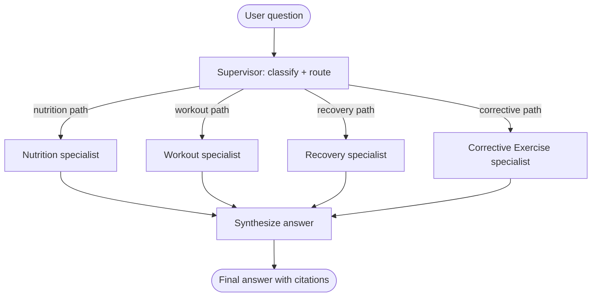
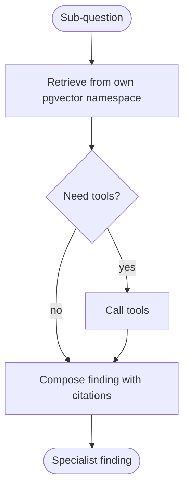

# Architecture

Fit T. Cent 3.0 (Centenarian Coach Multi-Agent) is a LangGraph
**supervisor + specialists** system. One
question goes in; a supervisor decides which specialists answer it; each
specialist runs its own retrieval and tools; a synthesizer weaves the findings
into one cited answer.

## Top-level graph



`START → supervisor → (fan-out to the chosen specialists) → synthesize → END`.
The supervisor returns a structured routing decision before any specialist runs;
the conditional edge out of it returns an array of node names, so the chosen
specialists run in parallel and fan back in to the synthesizer. Four specialists
ship: nutrition, workout, recovery, and corrective exercise.

Defined in [`src/graph.ts`](../src/graph.ts).

## A specialist subgraph

Each specialist is itself a small graph with its own state schema:



The subgraph's state has no `findings` channel, so a specialist cannot read
another specialist's output. An adapter node maps the subgraph's result into a
`SpecialistFinding` on the top-level state.

See [`src/agents/nutrition/subgraph.ts`](../src/agents/nutrition/subgraph.ts) and
[`src/agents/workout/subgraph.ts`](../src/agents/workout/subgraph.ts).

## Shared state

```ts
type CoachState = {
  sessionId: string;
  userQuery: string;
  routing?: RoutingDecision;          // who to consult + per-agent sub-questions
  findings: {                          // object-merge reducer — parallel-safe
    nutrition?: SpecialistFinding;
    workout?: SpecialistFinding;
    recovery?: SpecialistFinding;
    corrective?: SpecialistFinding;
  };
  finalAnswer?: { text: string; citations: Citation[]; consultedAgents: Agent[] };
};
```

The `findings` channel uses a merge reducer so parallel specialists each write
their own slot without overwriting one another. Defined in
[`src/state.ts`](../src/state.ts).

## Layout

| Path | Role |
|------|------|
| `src/agents/supervisor/` | Routing schema + supervisor node |
| `src/agents/nutrition/`  | Nutrition subgraph, retrieval, tools |
| `src/agents/workout/`    | Workout subgraph, retrieval, tools |
| `src/agents/recovery/`   | Recovery subgraph, retrieval, tools |
| `src/agents/corrective/` | Corrective Exercise subgraph, retrieval, tools |
| `src/synthesizer/`       | Synthesizer node (fan-in over findings) |
| `src/lib/`               | LLM factory, embeddings, pgvector, LangSmith gate |
| `src/app/api/coach/`     | Streaming query route |
| `src/app/coach/`         | The `/coach` UI |
| `kb-fixtures/`           | Empty by design; drop your own corpus here, then `pnpm kb:seed` writes to `coach_kb` |

The design decisions behind this are walked through in
[`docs/lessons/`](./lessons/README.md).
